<picture>
  <source media="(prefers-color-scheme: dark)" srcset="./dark.svg">
  <source media="(prefers-color-scheme: light)" srcset="./light.svg">
  
</picture>

 

### Hey, I'm Swapnil 👋

Full-stack developer and competitive programmer currently pursuing a B.Tech in Computer Science at **IIIT Nagpur** (CGPA 9.37/10). I like building complete, working products end-to-end and solving hard algorithmic problems along the way.

- 🔭 Currently building full-stack web products with React, Node.js and Express
- 🚀 Deployed a project using Docker, AWS, and Terraform
- 🧠 1000+ DSA problems solved · LeetCode 1780 · Codeforces Pupil (1382) · CodeChef 3★ (1657)
- 🌱 Contributing to open source as part of **GirlScript Summer of Code (GSSoC) 2026**
- 🤝 Co-Lead at **Elevate Development Club, IIIT Nagpur** — mentoring 200+ students in DSA and full-stack development
- 📫 Reach me at **swapnil22jain07@gmail.com**

---

### 🧑‍💻 Experience

**Software Developer Intern — Indian School of Founders** (Remote) · *Nov 2025 – Dec 2025*
`React.js` · `Tailwind CSS`
- Engineered and deployed a production-grade startup website, improving the Lighthouse performance score from 68 to 92+
- Optimized frontend rendering and API integration, reducing average page load time by 30%

**Co-Lead — Elevate Development Club, IIIT Nagpur** · *Aug 2025 – May 2026*
- Mentored 200+ students in Data Structures, Algorithms, and Full-Stack Development
- Led a team of 20 members and organized 5+ technical events and hackathons involving 200+ participants

---

### 🚀 Featured Projects

**[FixMyStreet](https://github.com/Swapnil220705/FixMyStreet)** — Scalable Civic Issue Reporting System
`React.js` · `Laravel` · `MySQL` · `REST APIs`
Complaint management platform with image uploads and role-based access control; normalized MySQL schema and optimized REST queries cut backend latency and average resolution time by ~40%.

**[Startup AI](https://github.com/Swapnil220705/Startup-AI)** — AI-Powered Business Planning Assistant
`React.js` · `Node.js` · `Express.js` · `Gemini API`
AI-driven workflow generating Lean Canvas models, MVP roadmaps, and pitch drafts through structured prompt design and modular backend services.

**[BharatNext](https://github.com/Swapnil220705/BharatNext)** — Cross-Platform News Application
`React Native (Expo)` · `TypeScript` · `REST APIs`
Multilingual news app with integrated Text-to-Speech and optimized API caching, cutting content load time by 25%.

---

### 🛠️ Engineering Stack

**Languages:**       

**Frameworks:**     

**Databases:**   

**Tools:**    

**Deployment / Cloud & DevOps:**   

---

### 🏆 Achievements

- 🥇 Winner — ESOC-X-Hack, IIIT Nagpur (1st among 100+ participants)
- 🏅 National Finalist — Hackwise, IIM Indore (Top 5% nationwide)
- 🥉 3rd place — 36-hour team hackathon at IIT Roorkee
- 💡 Selected Contributor — GirlScript Summer of Code (GSSoC) 2026

---

## 🐍 Contribution Snake

<picture>
  <source media="(prefers-color-scheme: dark)" srcset="https://raw.githubusercontent.com/Swapnil220705/github-snake/output/github-snake-dark.svg">
  <source media="(prefers-color-scheme: light)" srcset="https://raw.githubusercontent.com/Swapnil220705/github-snake/output/github-snake.svg">
  
</picture>

---

### 🔗 Connect

---

Built with a hand-crafted animated SVG system — <code>dark.svg</code> · <code>light.svg</code> · terminal UI · ASCII portrait

